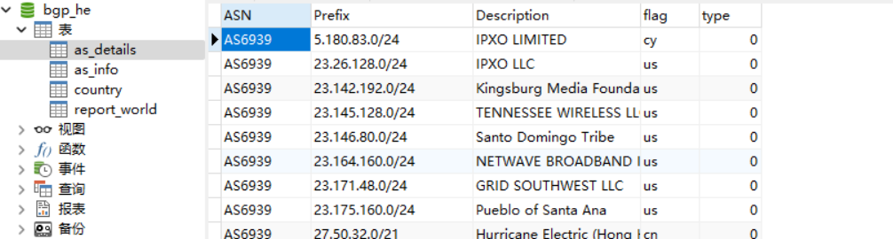

# BGP.HE.NET 爬虫项目介绍
## 项目简介
该项目旨在爬取 BGP.HE.NET 网站的数据，以提供关于全球自治系统（AS）的信息。通过爬取该网站，我们能够获取各个AS及其内部网段的数据，为实现指定AS号内的网络资产提供数据支撑。因为网站有反爬机制，大概200个同源IP请求会被封掉，项目中
使用了代理池进行爬取。

## 网站介绍
BGP.HE.NET 是一个提供全球BGP路由信息的网站，它包含了大量有关互联网路由的数据。该网站提供了对全球各个自治系统（AS）的详细信息，包括其网段、路由路径等。这些数据对于网络管理、安全监控以及网络拓扑分析等方面具有重要意义。

## 为何爬取该网站
爬取 BGP.HE.NET 网站的数据有以下几个重要原因：

+ 全球AS信息: 该网站收集了全球各个自治系统的信息，涵盖了广泛的网络范围。
+ 网络资产分析: 通过爬取AS及其内部网段的数据，我们能够实现对指定AS号内的网络资产进行全面的分析和监控。
+ 网络安全: 了解和分析AS的结构和路由信息对于网络安全具有重要意义，可以帮助发现潜在的安全威胁和漏洞。现有的网络资产测绘的源的数据应该都是从这里获取的。
## 如何使用该项目
docker-compose
项目目录下运行:
```
docker-compose up -d
```
## 报错解决
:broken_heart:可能会因为代理不稳定，导致爬取失败。
## 结果展示
爬取完后as_details表中会有所有AS域内具体的网段数据。


## 交流
如果有问题可以提issue


